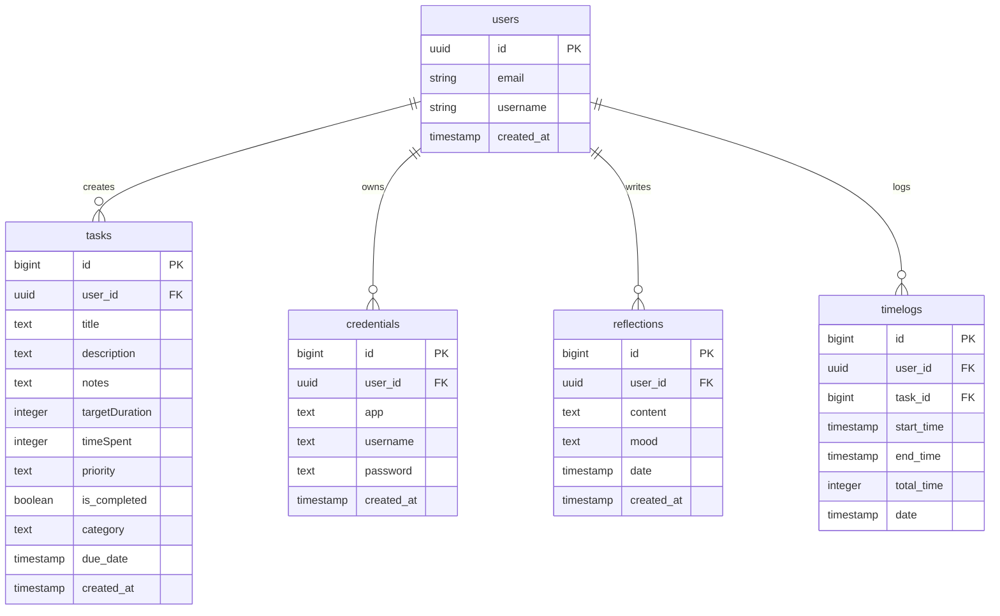

# Database Schema Documentation (`database-schema.md`)

## Database Overview
- **Database Management System**: PostgreSQL (hosted on Supabase Cloud)
- **ORMs / SDK**: Supabase JavaScript Client (`@supabase/supabase-js`)
- **Primary Auth Provider**: Supabase Built-in Auth (`auth.users`)

---

## 1. Entity-Relationship (ER) Diagram

---

## 2. Table Schemas & Specifications

### Table: `users`
Represents registered users in the application.
| Column Name | Data Type | Constraints | Default Value | Description |
| :--- | :--- | :--- | :--- | :--- |
| `id` | `UUID` | Primary Key, Foreign Key (`auth.users.id`) | `auth.uid()` | Unique user identifier |
| `user_id` | `UUID` | Optional Alias | NULL | Alias for user ID |
| `email` | `VARCHAR(255)` | Unique, Required | - | User email address |
| `username` | `VARCHAR(100)` | Unique, Optional | NULL | User display handle |
| `created_at` | `TIMESTAMPTZ` | Required | `now()` | Registration timestamp |

---

### Table: `tasks`
Stores user tasks, priority levels, estimated target duration, and logged time spent.
| Column Name | Data Type | Constraints | Default Value | Description |
| :--- | :--- | :--- | :--- | :--- |
| `id` | `BIGINT` | Primary Key, Auto-increment | Generated | Task unique ID |
| `user_id` | `UUID` | Foreign Key (`users.id`), Required | - | Task owner user ID |
| `title` | `TEXT` | Required, Non-empty | - | Task title |
| `description` | `TEXT` | Optional | `''` | Detailed task description |
| `notes` | `TEXT` | Optional | `''` | Additional task notes |
| `targetDuration` | `INTEGER` | Required | `0` | Target estimated time in seconds |
| `timeSpent` | `INTEGER` | Required | `0` | Logged actual time in seconds |
| `priority` | `VARCHAR(10)` | Optional (`'3'`, `'2'`, `'1'`, `'0'`) | `'1'` | Eisenhower priority level |
| `is_completed` | `BOOLEAN` | Required | `false` | Completion status boolean |
| `category` | `VARCHAR(50)` | Optional | `'General'` | Task organizational category |
| `due_date` | `TIMESTAMPTZ` | Optional | NULL | Optional due date deadline |
| `created_at` | `TIMESTAMPTZ` | Required | `now()` | Task creation timestamp |

---

### Table: `credentials`
Stores encrypted account login credentials for the Password Manager.
| Column Name | Data Type | Constraints | Default Value | Description |
| :--- | :--- | :--- | :--- | :--- |
| `id` | `BIGINT` | Primary Key, Auto-increment | Generated | Credential record ID |
| `user_id` | `UUID` | Foreign Key (`users.id`), Required | - | Owner user ID |
| `app` | `TEXT` | Required | - | App/Website name (e.g. Gmail, GitHub) |
| `username` | `TEXT` | Required | - | Stored account username or email |
| `password` | `TEXT` | Required | - | Stored account password |
| `created_at` | `TIMESTAMPTZ` | Required | `now()` | Record creation timestamp |

---

### Table: `reflections`
Stores daily reflection notes and calendar day entries.
| Column Name | Data Type | Constraints | Default Value | Description |
| :--- | :--- | :--- | :--- | :--- |
| `id` | `BIGINT` | Primary Key, Auto-increment | Generated | Reflection record ID |
| `user_id` | `UUID` | Foreign Key (`users.id`), Required | - | Reflection author ID |
| `content` | `TEXT` | Required | - | Journal content or date note |
| `mood` | `VARCHAR(50)` | Optional | NULL | Tracked mood status |
| `date` | `TIMESTAMPTZ` | Required | `now()` | Associated entry date |
| `created_at` | `TIMESTAMPTZ` | Required | `now()` | Record creation timestamp |

---

### Table: `timelogs`
Logs individual work sessions for specific tasks.
| Column Name | Data Type | Constraints | Default Value | Description |
| :--- | :--- | :--- | :--- | :--- |
| `id` | `BIGINT` | Primary Key, Auto-increment | Generated | Timelog ID |
| `user_id` | `UUID` | Foreign Key (`users.id`), Required | - | User ID |
| `task_id` | `BIGINT` | Foreign Key (`tasks.id`), Required | - | Associated task ID |
| `start_time` | `TIMESTAMPTZ` | Required | - | Session start time |
| `end_time` | `TIMESTAMPTZ` | Required | - | Session end time |
| `total_time` | `INTEGER` | Required | `0` | Session total duration (seconds) |
| `date` | `TIMESTAMPTZ` | Required | `now()` | Session date |
